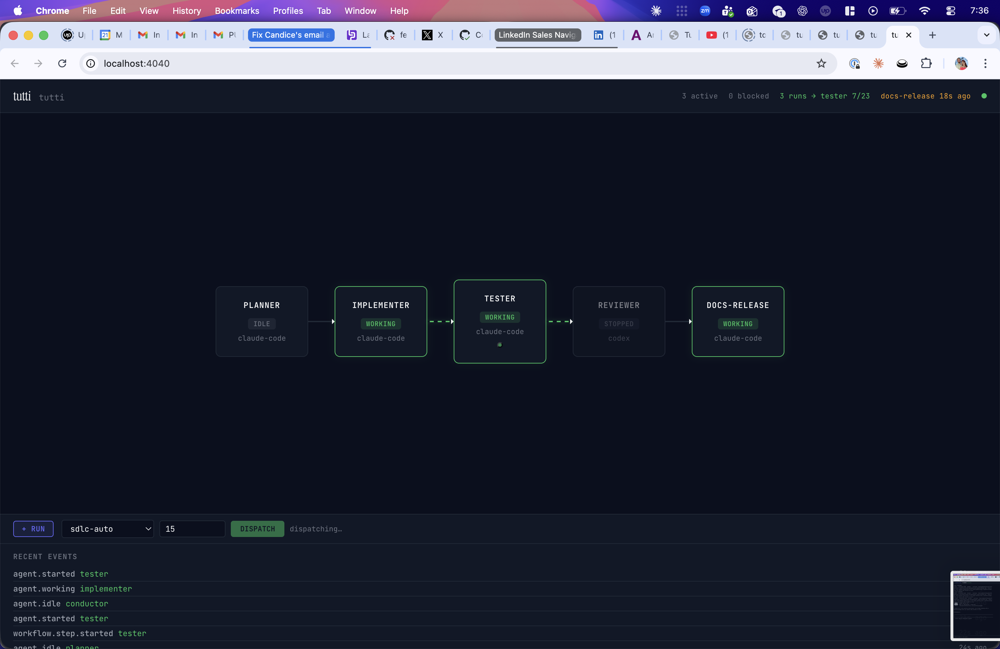
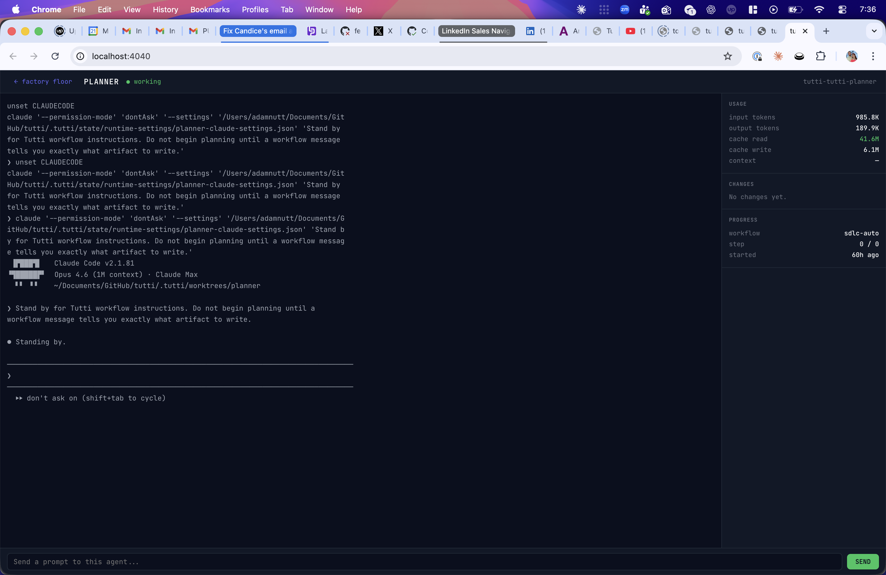

# tutti

**Multi-agent orchestration for AI coding tools. Coordinate Claude Code, Codex, and Aider agents as a team — with a real-time web dashboard, automated SDLC workflows, and per-agent git worktree isolation.**

```bash
cargo install tutti
```

Tutti spawns multiple AI coding agents in tmux sessions, gives each one its own git worktree, and orchestrates them through configurable workflows — plan, implement, test, review, ship. A web dashboard shows every agent's status in real time. Click any agent to see its live terminal output, token usage, and code changes.



*Factory floor: 3 agents working simultaneously, work-item dots flowing through the pipeline, dispatch panel to trigger runs from the browser.*



*Agent Focus Mode: live terminal output, token usage stats (985K input, 41.6M cache read), prompt bar to send instructions.*

## Quick Start

```bash
cargo install tutti        # install the CLI (requires Rust)
cd your-project
tt init                    # create a tutti.toml with detected runtimes
tt up                      # launch your agent team
tt serve --port 4040       # start the web dashboard at localhost:4040
tt run sdlc-auto           # run a full plan→implement→test→review→ship pipeline
```

**Prerequisites:** Rust toolchain, tmux, and at least one AI coding CLI installed (Claude Code, Codex, or Aider).

## What Tutti Does

- **Spawns and manages** multiple AI coding agent sessions (Claude Code, Codex, Aider) in tmux
- **Isolates each agent** in its own git worktree to prevent merge conflicts
- **Orchestrates workflows** — chain prompt steps, shell commands, and agent coordination into repeatable pipelines defined in `tutti.toml`
- **Web dashboard** at `:4040` — factory-floor view of all agents with real-time SSE updates, state-driven visuals (working/idle/stopped/blocked), and workflow run tracking
- **Agent Focus Mode** — click any agent to zoom into full-screen view with live terminal output, token usage, git diff, context health, and a prompt input bar
- **Automated SDLC** — claim a GitHub issue, plan, implement, test, open PR, request review — fully unattended
- **Resilience** — detects auth failures, rate limits, and provider outages; auto-recovers sessions based on configured strategies
- **Issue claim leases** — exclusive locks on GitHub issues for autonomous workflow runs

## What Tutti Does Not Do

- **Not another agent.** Tutti orchestrates existing agents — it never calls an LLM API directly.
- **Not tied to any provider.** Works with any agent CLI that runs in a terminal.
- **No API keys required.** Uses your existing agent CLI authentication.
- **No vendor lock-in.** Configuration is a single `tutti.toml` file you can version, share, or fork.

## When To Use Tutti

Tutti is strongest when **coordination is the bottleneck**, not raw model quality:

- You already run multiple agent sessions and the human is doing the routing, tracking, and merge management by hand
- Work splits cleanly into separable lanes: implementation, testing, docs, review
- You want persistent specialists working through a backlog, not five agents crowding one change
- The work contains waiting states that parallel agents can hide: test runs, review loops, CI, retries

A single agent is often the better choice when the repo is small, the task is tightly coupled, or the coordination tax would outweigh any throughput gain.

## Configuration

Your agent team topology is defined in `tutti.toml` — who does what, which runtime, what workflows:

```toml
[workspace]
name = "my-project"

[[agent]]
name = "implementer"
runtime = "claude-code"

[[agent]]
name = "tester"
runtime = "claude-code"

[[workflow]]
name = "verify"
[[workflow.step]]
type = "prompt"
agent = "tester"
text = "Run the test suite and report results."
wait_for_idle = true
```

Version it. Share it. Fork someone else's.

## Quick Start

```bash
# Install from crates.io
cargo install tutti

# Or install from source
git clone https://github.com/nutthouse/tutti.git
cd tutti
cargo install --path . --locked

# Initialize in your project
cd your-project
tt init

# Edit your team config
$EDITOR tutti.toml

# Launch
tt up
```

If `tt` is not found after install, add Cargo bin to your shell PATH:

```bash
echo 'export PATH="$HOME/.cargo/bin:$PATH"' >> ~/.zshrc
source ~/.zshrc
```

## Project Status (v0.5.0 — March 2026)

### Built and usable now
- Core CLI commands: `init`, `up`, `down`, `status`, `voices`, `watch`, `switch`, `diff`, `detect`, `land`, `review`, `send`, `handoff`, `attach`, `peek`, `logs`, `usage`, `run`, `verify`, `doctor`, `permissions`, `workspaces`, `issue-claim`
- Runtime adapters: Claude Code, Codex CLI, Aider
- Dependency-aware startup order (`depends_on`)
- Per-agent git worktree isolation
- Cross-workspace registry (`tt workspaces`, `tt up --all`, `tt down --all`)
- Token/capacity reporting via `tt usage` for API profiles (`plan = "api"`) from local Claude Code + Codex session logs
- `max_concurrent` launch guardrails per profile (`tt up` refuses launches above limit)
- Workspace `[[tool_pack]]` declarations + `tt doctor` prerequisite checks (commands/env/profile/runtime)
- API-profile budget guardrails (`[budget]`) with pre-exec checks on `tt up/send/run/verify`
- Issue claim leases with `tt issue-claim acquire|heartbeat|release|sweep` for autonomous SDLC loops
- `tt permissions suggest <workflow>` for batch command pre-approval
- Permission block errors include actionable fix hints
- `tt run --dry-run --json` includes literal command strings for pre-validation
- Resume intent log + compensator preflight for safe workflow replay
- SDLC automation framework with 6-agent topology (planner, conductor, implementer, tester, docs-release, reviewer)
- Orchestration state machine + run ledger for deterministic recovery

### Planned / in progress
- Session replacement flow (`tt handoff apply`) hardening and richer packet templates
- Image upload to remote agents (bridging files to agent context from the browser)
- Provider-level failover/rate-limit rotation
- Richer cost attribution and context-health telemetry
- OpenClaw integration hardening (packaging templates + external registry examples)
- Community phrase/arrangement registry

### Integration docs
- External agent/orchestrator contract: `docs/AGENT_INTEGRATION_CONTRACT.md`
- OpenClaw skill contract: `docs/OPENCLAW_SKILL_CONTRACT.md`
- OpenClaw skill starter: `skills/openclaw/SKILL.md`
- OpenClaw integration bundle: `integrations/openclaw/README.md`
- PR reproducibility loop (CodeRabbit + checks + merge gate): `docs/pr-review-loop.md`
- Versioning and release policy: `VERSIONING.md`

## tutti.toml

The team topology file. This is the "org code" — it defines your agent team as a versionable, forkable configuration.

```toml
[workspace]
name = "my-project"
description = "My project workspace"

[workspace.auth]
default_profile = "claude-personal" # profile from ~/.config/tutti/config.toml

[defaults]
worktree = true
runtime = "claude-code"

[launch]
mode = "auto"            # safe | auto | unattended
policy = "constrained"   # constrained | bypass

[budget]
mode = "warn"                  # warn | enforce
warn_threshold_pct = 80
workspace_weekly_tokens = 5000000

[budget.agent_weekly_tokens]
backend = 2000000
frontend = 1500000

[[agent]]
name = "backend"
runtime = "claude-code"          # or "codex", "aider", "gemini-cli", etc.
scope = "src/api/**"
prompt = "You own the API layer. Use existing patterns. Track work in bd."
fresh_worktree = true            # optional: reset this agent worktree on each tt up

[[agent]]
name = "frontend"
runtime = "claude-code"
scope = "src/app/**"
prompt = "You own the UI. Follow existing component patterns."

[[agent]]
name = "tests"
runtime = "codex"
scope = "tests/**"
prompt = "Write and maintain tests. Run the test suite after changes."
depends_on = ["backend", "frontend"]

[[workflow]]
name = "verify-app"
schedule = "*/30 * * * *"

[[workflow.step]]
id = "verify"
type = "command"
run = "cargo test --quiet"
cwd = "workspace"
subdir = "backend"              # optional workspace-relative command directory
fail_mode = "closed"
output_json = ".tutti/state/verify.json"

[[workflow.step]]
type = "ensure_running"
agent = "backend"

[[workflow.step]]
type = "prompt"
agent = "conductor"
text = "Summarize anomalies from latest snapshot and propose dispatch actions."
inject_files = [".tutti/state/snapshot.json"]

[[workflow.step]]
type = "workflow"
workflow = "verify-app"
strict = true
fail_mode = "closed"

[[workflow.step]]
type = "review"
agent = "backend"
reviewer = "reviewer"
depends_on = [4]

[[workflow.step]]
type = "land"
agent = "backend"
force = true
depends_on = [5]

[[hook]]
event = "workflow_complete"
workflow_source = "observe_cycle"
workflow_name = "verify-app"
run = "echo scheduled verify completed"
```

Profiles are configured globally in `~/.config/tutti/config.toml`:

```toml
[[profile]]
name = "claude-personal"
provider = "anthropic"
command = "claude"
max_concurrent = 5
plan = "max"
reset_day = "monday"
weekly_hours = 45.0
```

`tt usage` scans and aggregates usage only for profiles with `plan = "api"`.
`tt permissions` is opt-in and reads `[permissions]` from `~/.config/tutti/config.toml`.
With default launch mode (`auto`), constrained non-interactive runs require `[permissions]` allow rules.
For prompt steps that need workspace artifacts, use `inject_files = ["relative/path.json"]` to copy files into the target agent's working tree before the prompt is sent.
Prompt steps can capture artifacts with `artifact_glob` and `artifact_name` — after the prompt step completes, tutti globs for new files and registers them as step outputs. Downstream steps reference artifacts via `inject_files = ["{{output.artifact_name.path}}"]` or `{{output.artifact_name.path}}` in prompt text. Glob patterns support `~`, `{slug}`, `{workspace}`, and `{agent}` interpolation.
For command steps that should run under a workspace subpath, use `subdir = "relative/path"` instead of shell `cd ... &&`.
Use `depends_on = [<step-number>, ...]` on workflow steps to unlock dependency-aware execution; independent `ensure_running`/`review`/`land` steps run in parallel waves.
Budget guardrails are API-only: when `[budget]` is configured and the workspace profile has `plan = "api"`, Tutti checks budget caps before `up/send/run/verify`, emits `budget.threshold` / `budget.blocked` control events, and either warns or blocks based on `budget.mode`.

Optional tool packs can be declared per workspace and validated with `tt doctor`:

```toml
[[tool_pack]]
name = "analytics"
required_commands = ["bq", "jq"]
required_env = ["GCP_PROJECT"]
```

## Core Concepts

### Voices
Each running agent instance is a **voice** — the musical term for an individual part in an ensemble. `tt voices` lists what's playing.

### Arrangements
A `tutti.toml` file is an **arrangement** — the configuration that tells each voice what to play and when. Share arrangements, fork them, adapt them to your project.

### Movements
A **movement** is a phase of work — a logical grouping of tasks across agents. "Build the auth system" might be one movement containing work across backend, frontend, and test voices.

### Phrases
Reusable prompt components and skills are **phrases**. A phrase might be a CLAUDE.md snippet, a testing methodology, a code style guide, or an architectural pattern. Publish and share phrases through the community registry.

## Features

### Agent Management (Built)
- Spawn and manage agents from any supported runtime
- Git worktree isolation per agent (configurable)
- Session persistence across restarts
- Start and terminate individual agents (`tt up` / `tt down`)
- Inspect worktree + branch changes (`tt diff <agent>`)
- Land agent commits into current branch (`tt land <agent>`)
- Override local cleanliness guard when needed (`tt land <agent> --force`, with temporary stash/restore)
- Push/open PRs from agent branches (`tt land <agent> --pr`)
- Dispatch review packets to reviewer agent (`tt review <agent>`)
- Ad-hoc prompt dispatch with optional auto-start + wait + captured output (`tt send --auto_up --wait --output`)

### Automation (Built)
- `tt run` / `tt verify` reusable workflow execution with persisted run records
- Run checkpoints persisted at `.tutti/state/workflow-checkpoints/<run_id>.json` + `tt run --resume <run_id>`
- Workflow step types: `prompt`, `command`, `ensure_running`, `workflow` (nested), `review`, `land`
- Workflow `review`/`land` steps auto-start required sessions when they are not already running
- Workflow `land` steps enforce a GitHub merge gate (required checks green + all PR review threads resolved)
- `workflow_complete` hooks for deterministic chaining
- Auto-reclaim of newly-started `persistent = false` sessions at workflow end
- `tt serve` local control API endpoints:
  - Reads: `/v1/health`, `/v1/status`, `/v1/voices`, `/v1/workflows`, `/v1/runs`, `/v1/logs`, `/v1/handoffs`, `/v1/policy-decisions`, `/v1/events`
  - Event cursor/list filter: `/v1/events?cursor=<RFC3339 timestamp>&workspace=<name>`
  - SSE stream: `/v1/events/stream?cursor=<RFC3339 timestamp>&workspace=<name>`
  - Stream emits lifecycle/control events (`agent.started`, `agent.stopped`, `agent.working`, `agent.idle`, `agent.auth_failed`, `workflow.started`, `workflow.completed`, `workflow.failed`, handoff events)
  - Actions (POST): `/v1/actions/up|down|send|run|verify|review|land`
  - Envelope shape: `ok/action/error/data`
  - `send` action returns structured send result (`waited`, `completion_source`, `captured_output`)
  - Mutating actions support `Idempotency-Key` header (or `idempotency_key` request field)

### Observability (Built)
- Real-time status for all running agents
- Profile/workspace token usage and capacity estimates (`tt usage`, API profiles only)
- Interactive terminal watch mode with `PLAN` + live `CTX` plus quick attach/peek flow
- Per-agent log capture and tailing (`tt logs`)

### Handoffs (Built + Planned)
- `tt handoff generate <agent>` creates markdown packets in `.tutti/handoffs/`
- `tt handoff apply <agent>` injects latest packet into a running agent session
- `tt handoff list [--agent ...] [--json]` for packet discovery
- Auto packet generation in `tt watch` (and post-`tt up`) when `CTX` crosses configured handoff threshold
- Configurable packet templates and richer handoff content (planned)
- One-command session replacement polish/hardening (planned)

### Dashboard (Built)
- Factory-floor web dashboard at `:4040` with real-time SSE updates
- Pipeline stages with state-driven visuals (working/idle/stopped/blocked)
- Work-item dots flowing through stages during workflow runs
- **Agent Focus Mode**: click any stage card → full-screen drill-down with:
  - Live terminal output (polled every 2s)
  - Token usage stats (input, output, cache read/write)
  - Git diff of agent's worktree changes
  - Context health % with color-coded fill bar
  - Prompt input bar to send instructions to the agent
- Dispatch panel: trigger workflow runs from the browser
- Mobile-responsive layout with swipeable tabs on phone
- Cost breakdown by agent (planned: by provider, by time period)
- Provider health panel (auth status, rate limit state)

### Resilience (Partially Built)
- Auth failure detection (OAuth expiry, provider outages)
- Rate-limit/provider outage signal detection in health probes
- Emergency state capture on auth failures
- Workflow command retry/backoff (`[resilience].retry_*`)
- Launch-time profile rotation/fallback (`[resilience].provider_down_strategy = "rotate_profile"` or `rate_limit_strategy`)
- Runtime auth/rate-limit/provider-down recovery in `tt serve` (cooldown-throttled restart + strategy-aware profile rotation)
- Runtime auth/rate-limit/provider-down recovery in `tt watch` (cooldown-throttled restart + strategy-aware profile rotation)
- Correlated failure detection (provider-level vs individual agent) (planned)
- Runtime/session pause-resume orchestration (planned)

### Subscription Management (Partially Built)
- Multiple profiles per provider (personal, work, team accounts)
- Per-profile capacity settings (`plan`, `reset_day`, `weekly_hours`)
- Per-profile concurrency limits (`max_concurrent`) enforced by `tt up`
- Automatic launch-time profile rotation/fallback (built)
- `tt profiles` command (planned)

### Permissions Policy (Built, Opt-in)
- Team-shared command allowlist in `~/.config/tutti/config.toml` under `[permissions]`
- Policy entries may be shell command prefixes (`git status`, `cargo test`) and/or Claude tool names (`Read`, `Edit`, `Write`)
- `tt permissions check <command...>` evaluates command prefixes against policy
- `tt permissions export --runtime claude` emits a Claude settings scaffold
- `tt up` auto-wires constrained non-interactive policy for Claude sessions
- Codex/OpenClaw/Aider constrained mode is hard-enforced via Tutti shell-policy shims plus runtime flags/prompt guidance
- If constrained non-interactive launch is selected without policy, `tt up` fails with guidance
- Launch policy decisions are persisted to `.tutti/state/policy-decisions.jsonl` and exposed via `/v1/policy-decisions`

### Tool Packs (Built, Opt-in)
- Declarative `[[tool_pack]]` blocks in `tutti.toml` (`required_commands`, `required_env`)
- `tt doctor` reports pass/warn/fail for tmux, profile wiring, runtime binaries, and tool-pack prerequisites
- `tt doctor` also probes running agents for auth health (`auth/<agent>` checks)
- `tt doctor` validates serve readiness (`serve/state_dir`, `serve/events_log`, `serve/scheduler`, `serve/port`)
- CI smoke profile (`.github/workflows/ci.yml`) runs headless `tt doctor --strict` + `tt run smoke-check --strict`

### Community (Planned)
- Share and discover arrangements (team configs)
- Publish and install phrases (reusable prompts/skills)
- `tt browse` to explore what others are running

## Architecture

```
┌─────────────────────────────────────┐
│           tt (CLI)                  │
│  init · up · status · watch · usage │
├─────────────────────────────────────┤
│        Orchestration Core           │
│  Team topology · Agent lifecycle    │
│  Context monitoring · Cost tracking │
├──────────┬──────────┬───────────────┤
│ Runtime  │ Runtime  │ Runtime       │
│ Adapter: │ Adapter: │ Adapter:      │
│ Claude   │ Codex    │ Aider/Custom  │
├──────────┴──────────┴───────────────┤
│       Terminal Session Layer        │
│  tmux/zellij · git worktrees       │
│  PTY capture · ANSI parsing        │
├─────────────────────────────────────┤
│        Observation Layer            │
│  Token counting · Cost attribution  │
│  Status detection · Context health  │
├─────────────────────────────────────┤
│         Dashboard (optional)        │
│  Web UI · REST API · WebSocket feed │
└─────────────────────────────────────┘
```

## Supported Runtimes

| Runtime | Status | Notes |
|---------|--------|-------|
| Claude Code | ✅ Primary | Full support including context monitoring |
| Codex CLI | ✅ Supported | Token tracking via local Codex session logs |
| Aider | ✅ Supported | Model-agnostic |
| OpenClaw | ✅ Supported | Native runtime adapter (`runtime = "openclaw"`) |
| Gemini CLI | 🔜 Planned | |
| Custom | 🔜 Planned | Any CLI agent via adapter interface |

## Philosophy

**BYOS: Bring Your Own Subscription.** Tutti never asks for your API keys. It spawns agents using whatever CLI tools you already have installed and authenticated. If you can run `claude` in your terminal, Tutti can orchestrate it.

**Org code is real code.** How you structure your agent team is as important as the code they write. It should be versioned, reviewed, and iterable — just like infrastructure-as-code or CI/CD pipelines.

**Observe everything, control nothing.** Tutti watches what your agents do but doesn't intercept or modify their behavior. It's a coordination and visibility layer, not a proxy.

**Start simple, scale up.** One agent in a `tutti.toml` is fine. You don't need five agents and a complex topology on day one. Tutti should make even a single agent session better through observability and handoff support, then earn the right to add more agents when the work naturally separates.

## Contributing

Tutti is early. If this resonates with how you work, we want to hear from you.

- **Issues**: Bug reports, feature requests, questions
- **Discussions**: Share your arrangements, talk about workflows
- **PRs**: See CONTRIBUTING.md for guidelines
- **Debugging**: See [docs/OPERATOR_DEBUGGING.md](docs/OPERATOR_DEBUGGING.md) for the operator failure-debugging loop

## Roadmap

- [x] Core CLI (`tt init`, `tt up`, `tt down`, `tt status`, `tt voices`, `tt watch`, `tt switch`, `tt diff`, `tt detect`, `tt land`, `tt review`, `tt send`, `tt handoff`, `tt attach`, `tt peek`, `tt logs`, `tt usage`, `tt run`, `tt verify`, `tt doctor`, `tt permissions`, `tt workspaces`)
- [x] Claude Code runtime adapter
- [x] Codex runtime adapter  
- [x] Aider runtime adapter
- [x] `tt usage` profile/workspace capacity reporting
- [ ] Context health monitoring
- [x] Automatic handoff packet generation
- [x] Web dashboard (factory floor + Agent Focus Mode)
- [ ] Cost tracking and attribution (provider-accurate)
- [x] OpenClaw skill for Tutti orchestration workflows
- [x] Issue claim leases for autonomous SDLC loops
- [x] `tt permissions suggest` for batch workflow pre-approval
- [x] SDLC automation framework (issue → implement → test → PR → review → merge)
- [x] Published on crates.io (`cargo install tutti`)
- [ ] Agent-to-agent message bus
- [ ] Phrase registry (community prompts/skills)
- [ ] Arrangement sharing (community team configs)
- [x] Web dashboard (factory floor + Agent Focus Mode)

## License

MIT

---

*In music, tutti means "all together" — the moment every voice in the ensemble plays as one. That's what your agents should feel like.*
